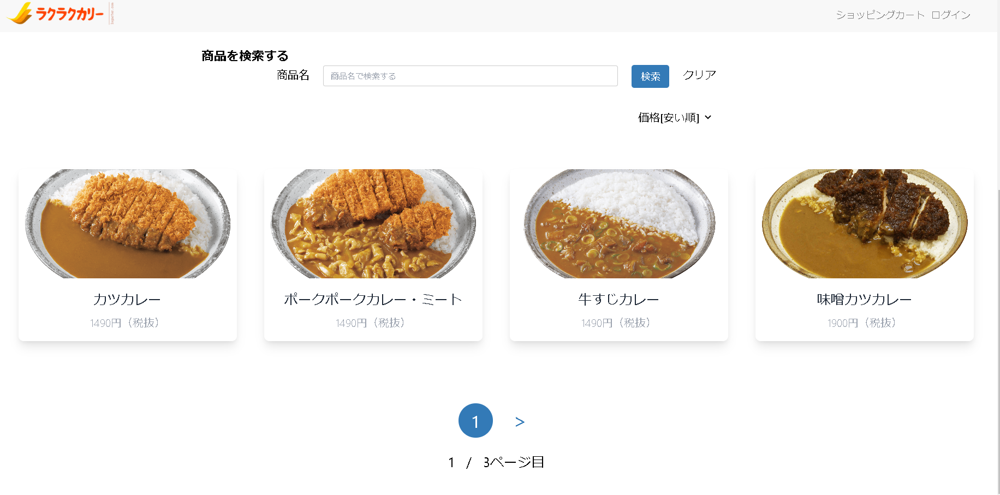
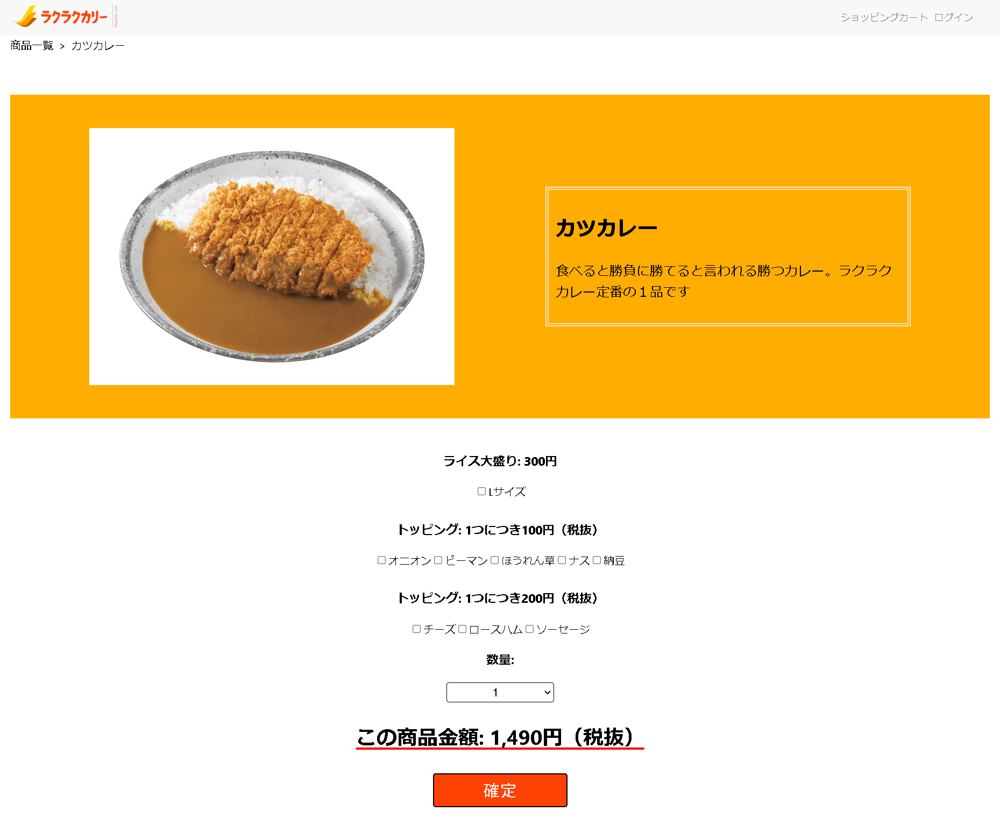
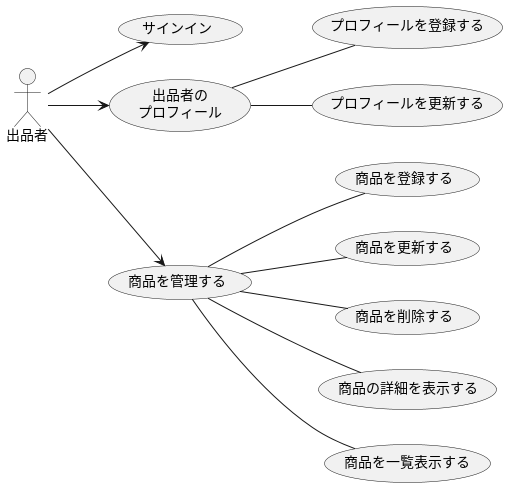

[Next.js](https://nextjs.org/)を使用した架空のECサイトです。

## 開発概要

### 1.ECサイトについて
商品一覧画面

商品詳細画面

### 2.開発フロー
ウォーターフォール型の開発です。要件定義と設計は既存のユースケースを使用したため、実装以降の部分を担当しました。

［使用したユースケース図］

### 3.使用した技術

使用した言語：Typescript

フレームワーク：Next.js(12.2.5)

データベース：JSONで仮想のデータベースを使用

